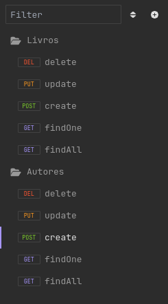
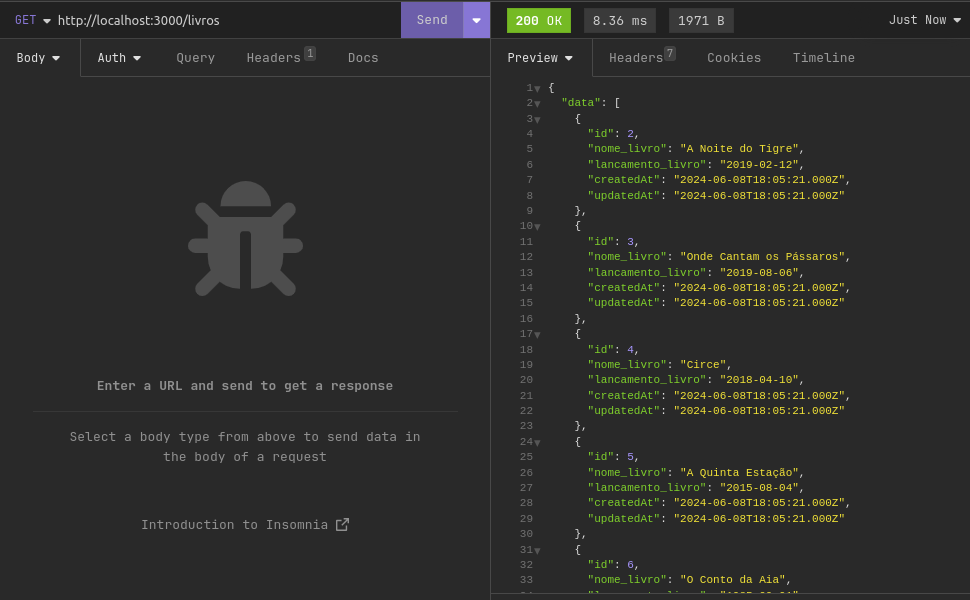
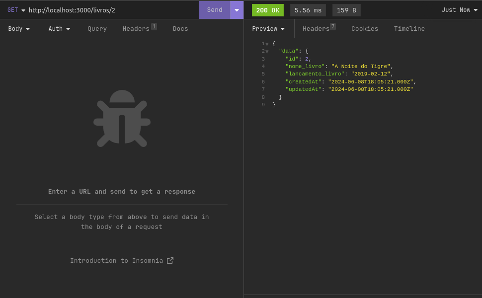
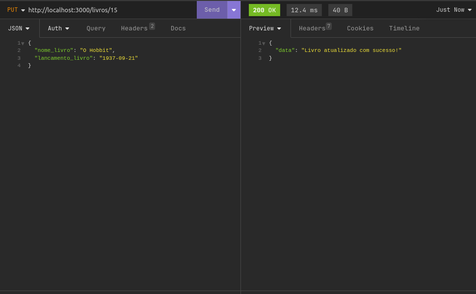
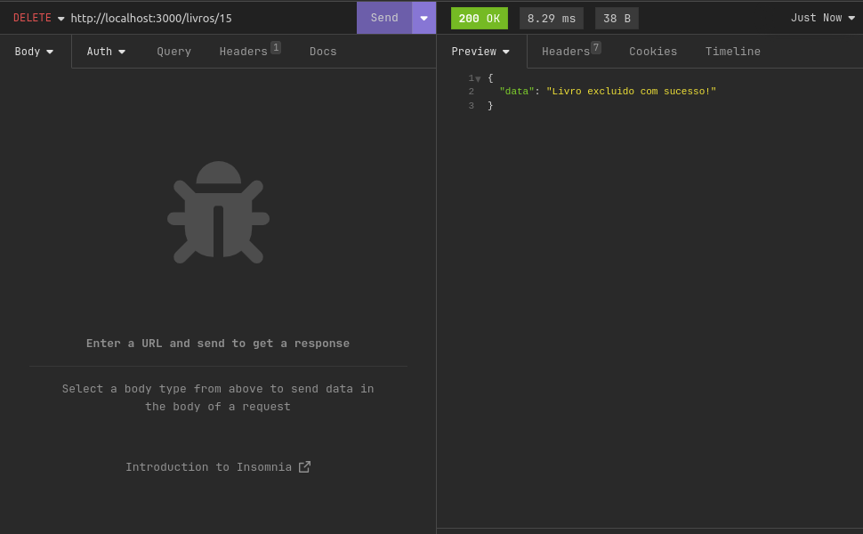

# Projeto de API de Livros e Autores

Este projeto é uma API que gerencia informações sobre livros e autores. Utiliza o framework Express para criar endpoints que permitem realizar operações CRUD (Create, Read, Update, Delete) tanto para livros quanto para autores.

O projeto foi desenvolvido como trabalho da disciplina de Web II
do curso de Análise e Desenvolvimento de Sistemas, terceiro semestre,
da Escola Superior Batista do Amazonas.

Professor: Érico Borgonove

Aluno: Davi Rosas Peres


## Pré-requisitos

- Node.js instalado
- Banco de dados configurado e rodando
- Arquivo `.env` configurado com as variáveis de ambiente necessárias

## Instalação

1. Clone o repositório:
   ```bash
   git clone https://github.com/Davissperes/api_web.git
   cd api_web

2. Instale a depêndencia:
    npm install

3. Configure o arquivo `.env`:
    Na pasta principal do projeto existe um arquivo de example que indica a forma que o `.env`
    deve ser preenchido para o funcinamento da aplicação.

## Endpoints

 Foram criadas rotas utilizando a aplicação insomnia para o reste dessa aplicação.

 Collections:
 
 

### Livros
 GET /livros: Retorna todos os livros
 
 

 GET /livros/:id: Retorna um livro específico por ID
 
 

 POST /livros: Cria um novo livro
 
 

 PUT /livros/:id: Atualiza um livro específico por ID
 
 

 DELETE /livros/:id: Deleta um livro específico por ID
 
 

### Autores

 GET /autor: Retorna todos os autores
 
 GET /autor/:id: Retorna um autor específico por ID
 
 POST /autor: Cria um novo autor
 
 PUT /autor/:id: Atualiza um autor específico por ID
 
 DELETE /autor/:id: Deleta um autor específico por ID
